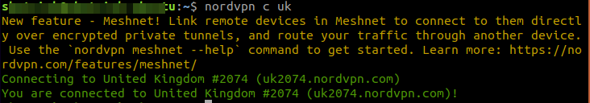
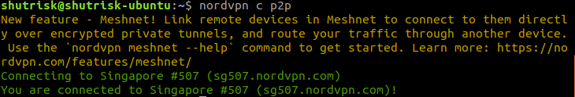
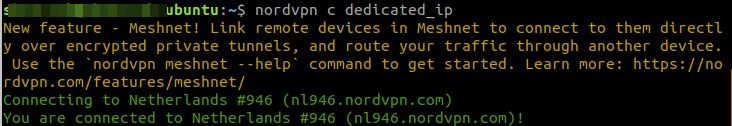
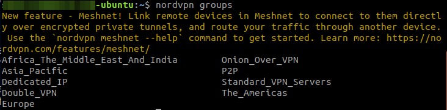

## Catatan

### Kenapa Catatan
Mengapa repo ini dinamakan catatan. Yaitu gunanya untuk tempat mencatat hal-hal yang dirasa penting, yang kemungkinan akan dilupakan dilain hari.

### Apa isi dari catatan.
Catatan ini akan berisi hal-hal termasuk cara troubleshoting problem dari kendala-kendala yang muncul dilapangan, yang sekiranya nanti akan terlupa oleh saya sendiri

### Daftar isi
* Update flameshot via flathub
* How to recover SQL Server SUSPECT Mode - Recovering a SQL Server 2000 Databases
* Mengubah mode database menjadi Single User lewat GUI
* Ada notifikasi kesalahan Command "python setup.py egg_info" failed with error code 1 in /tmp/pip-build-q9jfc54i/psycopg2-binary/
* Instalasi driver printer Canon G3010 Series di Windows XP
* Resuming Windows saat sedang menyalakan komputer di Windows 7 32bit
* Menginstall python versi 3.8 di Ubuntu 18.04 LTS
* Menginstall NordVPN di VPS (Ubuntu 18.04 LTS Server)


### Isi
#### Update flameshot via flathub (ubuntu desktop)
```
sudo flatpak install flathub org.flameshot.Flameshot
```

#### How to recover SQL Server SUSPECT Mode - Recovering a SQL Server 2000 Databases
Bagaimana cara me-recover Database dari SQL Server 2000 yang masuk mode SUSPECT. ( kurang lebih begitu translate-nya CMIIW)  

Beberapa waktu yang lalu, sedang ada kendala tentang aplikasi POS yang digunakan sedang terjadi gangguan dari segi database tidak bisa diakses. Berkali-kali mencari solusi di search engine dan baru ketemu solusi yang mantep banget dan akhirnya bisa running lagi SQL Server-nya.  

Solusi tersebut ditemukan dalam web [sqlservergeeks.com](https://www.sqlservergeeks.com/sql-server-suspect-mode-recovering-a-sql-server-2000-database)

Langsung saja.

1. Masuk ke Query Analyzer
2. Ketikkan dikolom script,  
```
EXEC sp_configure 'Allow updates','1'
Reconfigure with override
```
kemudian  
```
UPDATE master.dbo.sysdatabases
SET Status = -32768
WHERE [Name] = 'nama database'
GO
```
3. Script diatas akan membuat database yang awalnya suspect menjadi offline/readonly/emergency
4. Setelah database sudah ke mode emergency, ketikkan script dibawah ini. Script tersebut digunakan untuk membuat database tersebut menjadi single user (hanya bisa dibuka oleh 1 user/ 1 koneksi)
```
EXEC sp_dboption 'nama Database','Single User','TRUE'
```
5. Langkah selanjutnya adalah me-rebuild file Transactional Log dari database
`DBCC REBUILD_LOG('nama database','lokasi log database')`
```
DBCC REBUILD_LOG('nama database','D:\database\database_log.LDF')
```
Keterangan :
* nama database adalah database yang akan di-recovery
* lokasi log database adalah tempat dimana file log hasil rebuild dari database tersebut akan disimpan.

6. Setelah itu coba ketikkan perintah
```
DBCC CHECKDB('nama database')
```
Perintah tersebut digunakan untuk mengecek database, apakah database tersebut sudah terbebas dari error atau corrupt. Lihat log apakah database tersebut ada kendala tertulis atau tidak. Jika tidak ada error/warning maka harusnya database sudah bisa diakses lagi.

7. Jika database sudah bisa diakses kembali, tinggal masuk ke Database Properties dan kemudian un-check opsi DBO User Only Restricted Access

8. Jika database masih belum bisa diakses, coba script seperti dibawah ini.
```
DBCC CHECKDB('nama database',REPAIR_ALLOW_DATA_LOSS)
```
Script tersebut biasanya agak beresiko karena akan ada data yang sengaja dihapus karena data tersebut yang bikin korup atau error database tersebut Gunakan opsi terakhir itu jika benar-benar kepepet istilahnya.


CMIIW

#### Mengubah mode database menjadi Single User lewat GUI

Salah satu langkah yang digunakan untuk membuat database menjadi Single User dari sistem recovery diatas adalah via command yang dijalankan dengan menggunakan Query Manager.  

Ada cara lebih mudah lagi yakni menggunakan GUI yang tinggal klak klik dan mudah.

Cara ini hanya bisa digunakan ketika database sudah terlihat di Properties. Kalau masih belum terlihat Properties pas klik kanan database , maka masih harus menggunakan command.

1. Masuk ke aplikasi Enterprise Manager
2. Klik kanan database pilih Properties, kemudian dibagian Access, lihat Restrict mode dan

---BERLANJUT---

#### Command "python setup.py egg_info" failed with error code 1 in /tmp/pip-build-q9jfc54i/psycopg2-binary/
How to fix the pip9.exceptions.InstallationError

Make sure the version of your pip and setuptools is sufficient for manylinux2014 wheels.

* For System Install
```
sudo python3 -m pip install -U pip
sudo python3 -m pip install -U setuptools
```
* For Virtual Env / pipEnv
```
#Within the venv

pip3 install -U pip
pip3 install -U setuptools
```
source : [Stackoverflow](https://stackoverflow.com/questions/64095094/command-python-setup-py-egg-info-failed-with-error-code-1-in-tmp)

#### Instalasi Driver Printer Canon G3010 Series di Windows XP
Dikarenakan driver bawaan dari CD Driver printer G3010 tidak bisa diinstall dan digunakan dengan benar, maka akhirnya mencari ke situs [driverpack](driverpack.io). Akhirnya menemukan driver yang cocok digunakan dan berfungsi sebagaimana mestinya.  
Dengan nama file dan link-nya: [PIXMA_G3410_v1.01-drp](https://dl.driverpack.io/driverpacks/repack/Printer_Canon_Inkjet/PIXMA_G3410_v1.01/PIXMA_G3410_v1.01-drp.zip)  
Ini juga saya upload file di github juga sih.

#### Resuming Windows saat menyalakan komputer dengan OS Windows 7 32bit
Ternyata ada terkendala dengan keyboard yang menyebabkan komputer selalu dalam kondisi resuming windows terus. 

#### Menginstall Python 3.8 di Ubuntu 18.04 LTS
Cara menginstall python 3.8 di Ubuntu 18.04 LTS, sebelumnya saya kira di Ubuntu 18.04 LTS tidak akan bisa diinstall Python dengan versi diatas 3.6.x. Tapi setelah googling ternyata ada cara buat install Python 3.8 di Ubuntu 18.04 LTS

1. Pastikan login root atau sudo user dan eksekusi perintah dibawah 
```
sudo apt update
sudo apt install software-properties-common
```
2. Menambahkan deadsnake PPA ke source list 
```
sudo add-apt-repository ppa:deadsnakes/ppa
```
Jika ada pernyataan Enter untuk Continue, tekan Enter saja

3. Sesudah repositori sudah enable, install Python 3.8 dengan perintah 
```
sudo apt install python3.8
```
4. Verifikasi bahwa instalasi Python 3.8 sudah berhasil dengan perintah, jika instalasi telah sukses maka akan keluar output Python 3.8.x
```
python3.8 --version
```
Itulah cara menginstall Python 3.8 di Ubuntu 18.04 LTS

Source : [Linuxize](https://linuxize.com/post/how-to-install-python-3-8-on-ubuntu-18-04/)

#### Menginstall Pip untuk Python 3.8
Tak lengkap rupanya jika Python tanpa Pip, cara untuk menginstall pip untuk Python 3.8

1. Download menggunakan curl 
```
curl https://bootstrap.pypa.io/get-pip.py -o get-pip.py
```
2. Install file python yang sudah didownload menggunakan Python 3.8, dengan perintah
```
python3.8 get-pip.py
```
3. Cara mengetahui pip sudah terinstall adalah dengan menggunakan perintah 
```
pip3 --version
```

Source : [Stackoverflow](https://stackoverflow.com/questions/61717006/pip-for-python-3-8)

#### Menginstall NordVPN di VPS (Ubuntu 18.04 LTS Server)
Cara menginstall NordVPN di VPS yang menggunakan Ubuntu 18.04 LTS.

1. Download paket installer yang bisa didapat dihalaman download NordVPN
[disini](https://repo.nordvpn.com/deb/nordvpn/debian/pool/main/nordvpn-release_1.0.0_all.deb)
2. Setelah terdownload, install menggunakan perintah : sudo apt install (PATH dimana installer tadi disimpan).
```
sudo apt update
sudo apt install ./nordvpn-release_1.0.0_all.deb
```
Setelah beberapa saat, tunggu hingga selesai.

3. Install NordVPN dengan perintah 
```
sudo apt install nordvpn
```
Tunggu hingga proses tersebut selesai, hingga muncul tulisan **NordVPN for Linux successfully installed!**
4. Untuk login ke akun NordVPN tersebut adalah menggunakan perintah `nordvpn login --legacy`
Masukkan email dan password ke terminal tersebut dan tekan Enter.
Beberapa saat akan jika sudah berhasil login akan muncul pernyataan **Welcome to NordVPN! You can now connect to VPN by using 'nordvpn connect'.**

NB: Sebenernya untuk Linux desktop hanya perlu menggunakan perintah `nordvpn login` untuk login ke NordVPN, tapi karena di mesin headless tidak bisa menggunakan browser seperti firefox atau chrome, maka harus menyertakan --legacy. Kalau menggunakan perintah `nordvpn login` akan ada sebuah url yang bisa dicopy paste ke browser kita, dan login via browser.

5. Untuk konek ke VPN yang diinginkan tinggal menggunakan perintah `nordvpn connect` aplikasi NordVPN akan secara otomatis memilihkan server yang terdekat dengan lokasi saat ini.  
Tapi misal kita ingin memilih lokasi yang diinginkan untuk terkoneksi dengan NordVPN, kita tinggal memasukkan negara atau protokol yang ingin dituju. Misal jika ingin konek menggunakan IP United Kingdom, kita tinggal memasukkan perintah `nordvpn connect uk` atau `nordvpn c uk` (perintah c bisa sebagai shortcut untuk perintah connect).  
  
Untuk _disconnect_ tinggal menggunakan perintah `nordvpn disconnect` atau `nordvpn d`.
Misal juga kita ingin menggunakan NordVPN tersebut untuk proses download torrent, ada baiknya menggunakan protokol P2P yang telah disediakan NordVPN, perintahnya cukup menggunakan `nordvpn c p2p`.  
  
Jika ingin menggunakan metode Dedicated IP dari NordVPN ya tinggal `nordvpn c dedicated_ip`.  
  
Jika ingin menggunakan metode lain, coba ketik menggunakan perintah `nordvpn groups`, perintah itu akan me-list groups apa saja yang bisa digunakan.  

Yang paling pentin kalau tidak tahu perintah apa yang digunakan tinggal ketik `nordvpn help`.

Cukup sekian cara untuk instalasi NordVPN di Linux Ubuntu 18.04 LTS Server. Cara diatas juga bisa digunakan untuk Linux Ubuntu 18.04 yang versi desktop.
