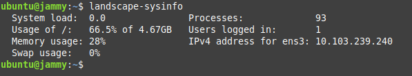

## Catatan

### Kenapa Catatan
Mengapa repo ini dinamakan catatan. Yaitu gunanya untuk tempat mencatat hal-hal yang dirasa penting, yang kemungkinan akan dilupakan dilain hari.

### Apa isi dari catatan.
Catatan ini akan berisi hal-hal termasuk cara troubleshoting problem dari kendala-kendala yang muncul dilapangan, yang sekiranya nanti akan terlupa oleh saya sendiri

### Daftar isi
* Update flameshot via flathub
* Instalasi driver printer Canon G3010 Series di Windows XP
* Resuming Windows saat sedang menyalakan komputer di Windows 7 32bit
* Menghapus sebuah PPA Repository dari sources.list
* Melakukan perintah berulang menggunakan for loops di bash shell
* [How to recover SQL Server SUSPECT Mode - Recovering a SQL Server 2000 Databases](./sql-server-suspect-mode.md)
* [Mengubah mode database menjadi Single User lewat GUI](./sql-server-2000-single-user-gui.md)
* [Ada notifikasi kesalahan Command "python setup.py egg_info" failed with error code 1 in /tmp/pip-build-q9jfc54i/psycopg2-binary/](./python-setup-egg-info.md)
* [Menginstall python versi 3.8 di Ubuntu 18.04 LTS + install pip](./python-3.8-ubuntu-bionic.md)
* [Menginstall NordVPN di VPS (Ubuntu 18.04 LTS Server)](./nordvpn-vps-ubuntu-bionic.md)
* [Instalasi Multipass di Linux Mint](./multipass-linux-mint.md)

### Isi
#### Install Landscape Sysinfo
Ingin melihat status dari komputer yang sedang digunakan? Gunakan perintah `landscape-sysinfo`, jika masih belum terinstall bisa gunakan perintah seperti dibawah ini
```shell
sudo apt install landscape-common
```

#### Update flameshot via flathub (ubuntu desktop)
```shell
sudo flatpak install flathub org.flameshot.Flameshot
```
#### Instalasi Driver Printer Canon G3010 Series di Windows XP
Dikarenakan driver bawaan dari CD Driver printer G3010 tidak bisa diinstall dan digunakan dengan benar, maka akhirnya mencari ke situs [driverpack](driverpack.io). Akhirnya menemukan driver yang cocok digunakan dan berfungsi sebagaimana mestinya.  
Dengan nama file dan link-nya: [PIXMA_G3410_v1.01-drp](https://dl.driverpack.io/driverpacks/repack/Printer_Canon_Inkjet/PIXMA_G3410_v1.01/PIXMA_G3410_v1.01-drp.zip)  
Ini juga saya upload file di github juga sih.

#### Resuming Windows saat menyalakan komputer dengan OS Windows 7 32bit
Ternyata ada terkendala dengan keyboard yang menyebabkan komputer selalu dalam kondisi resuming windows terus. 

#### Menghapus sebuah PPA Repository dari sources.list

1. Masuk ke direktori `/etc/apt/sources.list.d/`, misal yang mau dihapus adalah `ondrej-ubuntu-php-jammy`
```shell
cd /etc/apt/sources.list.d
sudo rm ondrej-ubuntu-php-jammy
```
2. Coba update package lagi dengan `sudo apt update / apt update`

#### Melakukan perintah berulang menggunakan for loops di bash shell
Studi kasus pengen me-compress zip semua file dalam satu folder yang berisi banyak file txt dengan syarat 1 file txt menjadi sebuah file zip sendiri-sendiri. Misal ada 100 file txt maka harus menjadi 100 file zip.  
Ada 2 cara:

1. Buat sebuah file script berekstensi .sh, misal _forloops.sh_ kemudian jalankan dengan perintah `bash forloops.sh`
    ```shell
    #!/usr/bin/bash
    for i in *.txt
    do
    7z a $i.7z $i
    done
    ```
    Script diatas akan melakukan proses loop perintah membuat sebuah file zip dari file txt yang berada difolder tersebut.  
2. Jika ingin menggunakan one-line command ya tinggal ketikkan seperti dibawah ini:
        ```shell
        for i in *.txt;do 7z a $i.7z $i;done
        ```
        Hasilnya akan sama saja dengan perintah diatas.

