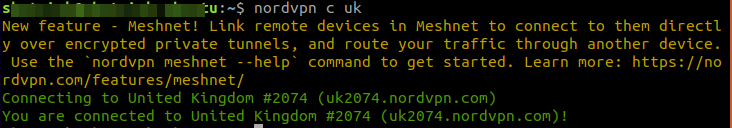
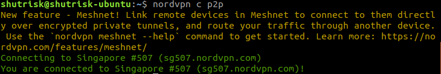
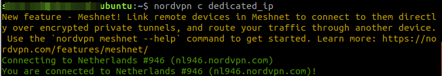
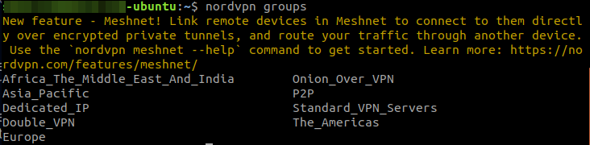

#### Menginstall NordVPN di VPS (Ubuntu 18.04 LTS Server)
Cara menginstall NordVPN di VPS yang menggunakan Ubuntu 18.04 LTS.

1. Download paket installer yang bisa didapat dihalaman download NordVPN
[disini](https://repo.nordvpn.com/deb/nordvpn/debian/pool/main/nordvpn-release_1.0.0_all.deb)
2. Setelah terdownload, install menggunakan perintah : sudo apt install (PATH dimana installer tadi disimpan).
```shell
sudo apt update
sudo apt install ./nordvpn-release_1.0.0_all.deb
```
Setelah beberapa saat, tunggu hingga selesai.

3. Install NordVPN dengan perintah 
```shell
sudo apt install nordvpn
```
Tunggu hingga proses tersebut selesai, hingga muncul tulisan **NordVPN for Linux successfully installed!**

4. Untuk login ke akun NordVPN tersebut adalah menggunakan perintah `nordvpn login --legacy`
Masukkan email dan password ke terminal tersebut dan tekan Enter.
Beberapa saat akan jika sudah berhasil login akan muncul pernyataan **Welcome to NordVPN! You can now connect to VPN by using 'nordvpn connect'.**

NB: Sebenernya untuk Linux desktop hanya perlu menggunakan perintah `nordvpn login` untuk login ke NordVPN, tapi karena di mesin headless tidak bisa menggunakan browser seperti firefox atau chrome, maka harus menyertakan --legacy. Kalau menggunakan perintah `nordvpn login` akan ada sebuah url yang bisa dicopy paste ke browser kita, dan login via browser.

5. Untuk konek ke VPN yang diinginkan tinggal menggunakan perintah `nordvpn connect` aplikasi NordVPN akan secara otomatis memilihkan server yang terdekat dengan lokasi saat ini.  
Tapi misal kita ingin memilih lokasi yang diinginkan untuk terkoneksi dengan NordVPN, kita tinggal memasukkan negara atau protokol yang ingin dituju. Misal jika ingin konek menggunakan IP United Kingdom, kita tinggal memasukkan perintah `nordvpn connect uk` atau `nordvpn c uk` (perintah c bisa sebagai shortcut untuk perintah connect).  
  
Untuk _disconnect_ tinggal menggunakan perintah `nordvpn disconnect` atau `nordvpn d`.
Misal juga kita ingin menggunakan NordVPN tersebut untuk proses download torrent, ada baiknya menggunakan protokol P2P yang telah disediakan NordVPN, perintahnya cukup menggunakan `nordvpn c p2p`.  
  
Jika ingin menggunakan metode Dedicated IP dari NordVPN ya tinggal `nordvpn c dedicated_ip`.  
  
Jika ingin menggunakan metode lain, coba ketik menggunakan perintah `nordvpn groups`, perintah itu akan me-list groups apa saja yang bisa digunakan.  
  
Yang paling pentin kalau tidak tahu perintah apa yang digunakan tinggal ketik `nordvpn help`.

Cukup sekian cara untuk instalasi NordVPN di Linux Ubuntu 18.04 LTS Server. Cara diatas juga bisa digunakan untuk Linux Ubuntu 18.04 yang versi desktop.

**CARA TERMUDAH dari situs resmi NordVPN**
```shell
1. Click the big blue Download button up above and download the installer (nordvpn-release_1.0.0_all.deb).

2. Open Terminal and run the following command:
sudo dpkg -i /pathToFile/nordvpn-release_1.0.0_all.deb

3. Replace /pathToFile/ with the location of the downloaded NordVPN installer (for example, if it’s in the Downloads folder, the command goes:
sudo dpkg -i ~/Downloads/nordvpn-release_1.0.0_all.deb)

4. Enter your root password and wait for the installation to finish.

5. Update the package list:
sudo apt update (or sudo apt-get update)
sudo apt upgrade (or sudo apt-get upgrade)

6. Install the NordVPN app:
sudo apt install nordvpn (or sudo apt-get install nordvpn)

7. Log in to your NordVPN account:
nordvpn login

8. Connect to a NordVPN server:
nordvpn connect
```